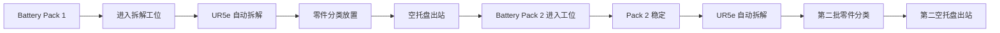
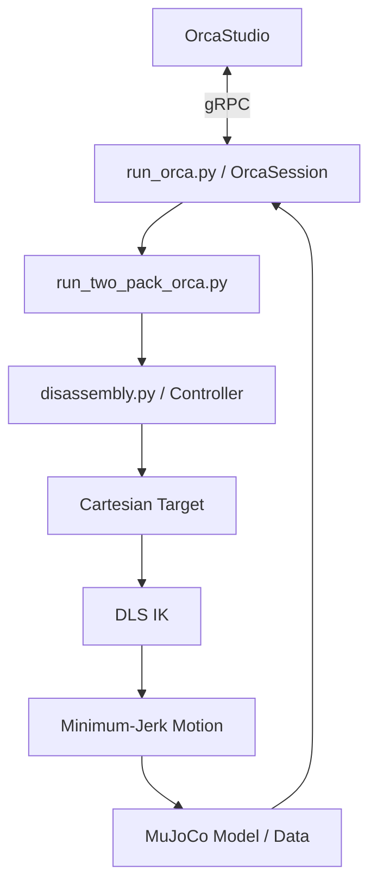

<div align="center">

# EV Battery Disassembly Workcell

### 基于 UR5e + MuJoCo + OrcaStudio 的双电池包自动拆解仿真工作站

面向 EV 电池包自动化拆解场景，构建包含 **输送线、UR5e 机械臂、真空吸盘、分类料箱、空托盘回收区与工业工作站外围设施** 的连续拆解仿真 Demo。

[](https://github.com/jerryzhu-yc/ev-battery-disassembly-demo/actions/workflows/sanity-check.yml)


</div>

---

## 项目简介

本项目实现一个 **双电池包连续自动拆解工作站**。

UR5e 六自由度机械臂搭载 SMC 风格真空吸盘，对到达拆解工位的电池包依次完成：

- 电池上盖拆除
- 两组汇流排拆除
- 四个电芯拆除
- 不同类别零件分类放置
- 第一包与第二包连续切换
- 拆解后的空托盘输送与回收流程

机器人控制侧结合 **Cartesian TCP 控制、6D Damped Least Squares IK、Minimum-Jerk 轨迹插值、自适应安全高度与放置结果验证**，并通过 OrcaStudio / gRPC 与 MuJoCo 仿真场景联动。

当前仓库中的 `scene_two_pack.xml` 已进一步扩展为更完整的工业工作站场景，包括安全警戒区域、防护围栏、电控柜、HMI、三色状态灯、急停站、工作站标识以及工业照明等外围设施。

> 本项目当前定位为 **robotics simulation / research demo**，重点验证拆解流程、机器人运动规划、连续生产节拍与仿真系统集成，不等同于实际工业产线控制系统。

---

## 核心特性

| 模块 | 当前实现 |
|---|---|
| Robot | UR5e 六自由度机械臂 |
| End Effector | SMC 风格真空吸盘 |
| Physics | MuJoCo |
| Simulation Frontend | OrcaStudio |
| Communication | gRPC |
| Motion Planning | Cartesian motion + 6D DLS IK |
| Trajectory | Minimum-Jerk interpolation |
| Safety Motion | 自适应安全高度 + 分段转移路径 |
| Production Flow | 双电池包连续拆解 |
| Sorting | 上盖 / 汇流排 / 电芯分类 |
| Validation | 放置位置、姿态与稳定状态验证 |
| Workcell | 输送带、分类箱、空托盘回收区、工业安全设施 |
| CI | GitHub Actions Python/XML sanity check |

---

## 工作站组成

当前仿真场景主要由以下部分组成：

```text
┌─────────────────────────────────────────────────────┐
│                 Industrial Workcell                 │
│                                                     │
│   Safety Fence / HMI / Control Cabinet / Stack Light│
│                                                     │
│        ┌──────────────────────────────┐             │
│        │          Conveyor            │             │
│        │   Pack 1        Pack 2       │             │
│        └──────────────┬───────────────┘             │
│                       │                             │
│                    UR5e +                           │
│                 Vacuum Gripper                      │
│                       │                             │
│      Cover Bin   Busbar Bin   Cell Bins             │
│                                                     │
│                     Empty Tray Bin                  │
└─────────────────────────────────────────────────────┘
```

### 工业场景元素

除核心拆解设备外，`scene_two_pack.xml` 还包含：

- 工业工作区地面
- 黄色安全警戒线
- 透明安全防护围栏
- 电气控制柜
- HMI 面板
- 红 / 黄 / 绿三色状态灯
- 急停按钮站
- 工作站标识
- 工业照明
- 输送带检测器外观模型

这些外围模型主要用于提升工作站完整性与工业场景表现，不改变现有机器人核心运动控制逻辑。

---

## 双电池包连续流程



第二包不会重新创建一套独立拆解算法，而是通过 `Pack2Controller` 将标准零件名称自动映射到 `pack2_*` 对象，实现同一套拆解逻辑复用。

---

## 单个电池包拆解顺序

每个电池包共执行 **7 个 Pick-and-Place 任务**：

```text
battery_cover
    ↓
battery_busbar_1
    ↓
battery_busbar_2
    ↓
battery_cell_1
    ↓
battery_cell_2
    ↓
battery_cell_3
    ↓
battery_cell_4
```

---

## 单零件运动流程

```text
Prepare
   ↓
Approach
   ↓
Pick
   ↓
Attach
   ↓
Vertical Separation
   ↓
Lift
   ↓
Retract
   ↓
Arc Transfer
   ↓
Bin Clearance
   ↓
Place
   ↓
Release
   ↓
Physics Settling
   ↓
Placement Verification
   ↓
Return
```

设计目标不是简单地把 TCP 从 A 点直线移动到 B 点，而是让机械臂在电池包、机器人基座和分类箱之间采用更稳定的分段运动。

---

## 运动控制设计

### 1. 6D Damped Least Squares IK

`Controller.solve()` 使用 6D Damped Least Squares（DLS）求解 UR5e 逆运动学。

输入：

```text
目标 TCP 位置 + 固定工具姿态
```

输出：

```text
6 个 UR5e 关节角
```

求解过程同时考虑：

- TCP position error
- TCP orientation error
- Joint limits
- Workspace reachability
- 实际工程容差

---

### 2. Minimum-Jerk 轨迹

机械臂直线移动过程使用五次多项式 Minimum-Jerk 插值，使运动在起点和终点附近保持较平滑的速度与加速度变化。

```text
Current TCP
    ↓
Minimum-Jerk interpolation
    ↓
Intermediate TCP targets
    ↓
IK
    ↓
UR5e joint motion
```

---

### 3. 自适应安全高度

固定使用较高 TCP 高度会使 UR5e 在工作空间边缘位置出现 IK 不可达。

因此当前控制器会根据：

- 零件当前高度
- 当前 TCP 高度
- 分离需求
- UR5e 工作空间

动态计算：

```text
safe_high_z
approach_z
lift_z
transfer height
return height
```

从而降低：

```text
MotionError: Unreachable pose
```

出现的概率。

---

### 4. 安全转移路径

机器人从电池包区域前往地面分类箱时，不直接穿过机械臂基座附近，而采用：

```text
Current Position
      ↓
Retract to safe radius
      ↓
Arc around robot base
      ↓
Move to bin clearance pose
      ↓
Descend
```

这使路径更适合当前工作站几何布局。

---

## 零件分类规则

### Battery Cover

```text
battery_cover
    ↓
bin_cover
```

### Busbars

```text
battery_busbar_1
battery_busbar_2
    ↓
bin_busbar
```

### Cells — Batch 1

```text
battery_cell_1
battery_cell_2
battery_cell_3
battery_cell_4
    ↓
bin_cell
```

### Cells — Batch 2

```text
pack2_battery_cell_1
pack2_battery_cell_2
pack2_battery_cell_3
pack2_battery_cell_4
    ↓
bin_cell_2
```

第二批电芯使用独立分类区域，避免与第一批四个电芯发生空间重叠。

---

## 仿真与物理模型

项目采用 **运动学机器人控制 + MuJoCo 物理仿真** 的混合方式。

### Robot

UR5e 的主要运动由 Cartesian trajectory + IK 控制。

### Vacuum Gripper

当前吸附模型为理想化 attachment：

```text
TCP
 │
 └── Payload
```

它重点用于验证机器人拆解流程，而不是建立完整的真空压力、泄漏和吸附力模型。

### Released Parts

零件释放后交由 MuJoCo 处理：

- Gravity
- Contact
- Collision
- Bounce
- Sliding
- Settling

### Empty Tray

拆解后的电池基座通过输送与回收流程进入绿色空托盘回收区域。

该部分目前仍属于仿真接触参数调优项；若修改回收箱几何尺寸、位置或碰撞参数，需要重新验证托盘接触稳定性。

---

## 项目结构

```text
ev-battery-disassembly-demo/
│
├── README.md
├── requirements.txt
├── .gitignore
│
├── scene_two_pack.xml
├── disassembly.py
├── run_orca.py
├── run_two_pack_orca.py
│
├── assets/
│   └── UR5e / scene mesh assets
│
├── tools/
│   └── make_two_pack_scene.py
│
└── .github/
    └── workflows/
        └── sanity-check.yml
```

### `scene_two_pack.xml`

当前最终工作站场景，包含：

- UR5e
- 机器人基座
- SMC 风格吸盘
- 双电池包
- 输送带
- 分类料箱
- 空托盘回收箱
- 工业工作站外围设施
- MuJoCo collision geometry
- Lights / markers / safety-area visuals

### `disassembly.py`

核心机器人拆解控制器，负责：

- UR5e joint / TCP control
- 6D DLS IK
- Minimum-Jerk trajectory
- Adaptive safe height
- Ideal suction attachment
- Collision checking
- Pick-and-place sequencing
- Physical settling
- Placement verification

### `run_orca.py`

OrcaStudio 与 MuJoCo 控制器之间的通信桥接。

主要负责：

- gRPC connection
- MuJoCo model / data access
- State synchronization
- OrcaStudio rendering synchronization

### `run_two_pack_orca.py`

双电池包连续拆解主入口，负责：

- Batch 1 调度
- 空托盘出站
- Pack 2 入站
- Pack 2 physics settle
- Batch 2 调度
- 第二批分类位置
- 两批连续生产流程

### `tools/make_two_pack_scene.py`

开发阶段的场景生成辅助脚本。

当前正常运行 Demo 时直接使用已经提交的：

```text
scene_two_pack.xml
```

无需重新生成场景。

---

## 软件架构



---

## 环境要求

当前项目开发环境：

```text
Ubuntu
Conda
Python
MuJoCo
OrcaStudio
OrcaLab / OrcaGym SDK
```

推荐使用项目现有 Conda 环境：

```bash
conda activate orcalab
```

安装公开 Python 依赖：

```bash
pip install -r requirements.txt
```

`requirements.txt` 当前包含：

```text
numpy
mujoco
grpcio
```

> `orca_gym` 由 OrcaStudio / OrcaLab SDK 环境提供，因此没有通过本仓库的 `requirements.txt` 自动安装。

---

## Quick Start

### 1. Clone

```bash
git clone git@github.com:jerryzhu-yc/ev-battery-disassembly-demo.git
cd ev-battery-disassembly-demo
```

### 2. Activate Environment

```bash
conda activate orcalab
```

### 3. Load Scene

在 OrcaStudio 中导入：

```text
scene_two_pack.xml
```

启动仿真，并确保 gRPC 服务运行于：

```text
localhost:50051
```

### 4. Run Two-Pack Demo

```bash
python run_two_pack_orca.py \
  --addr localhost:50051 \
  --prefix scene_two_pack_usda_
```

当前测试运动速度约为：

```text
Cartesian speed : 0.360 m/s
Joint speed     : 1.600 rad/s
```

---

## OrcaStudio Prefix

OrcaStudio 导入场景后可能为对象添加 namespace / prefix。

当前常用：

```text
scene_two_pack_usda_
```

因此运行时需要：

```bash
--prefix scene_two_pack_usda_
```

如果修改 XML 文件名、导入名称或 OrcaStudio scene namespace，请同步检查该参数。

---

## Sanity Check

提交前可以执行：

```bash
python -m py_compile \
  disassembly.py \
  run_orca.py \
  run_two_pack_orca.py \
  tools/make_two_pack_scene.py
```

检查 XML：

```bash
python - <<'PY'
import xml.etree.ElementTree as ET

ET.parse("scene_two_pack.xml")
print("scene_two_pack.xml: OK")
PY
```

仓库同时提供：

```text
.github/workflows/sanity-check.yml
```

GitHub Actions 会在 Push / Pull Request 后执行基础 Python 与 XML 检查。

---

## 当前实现边界

本项目目前主要关注 **机器人拆解工作流与仿真验证**。

以下内容属于理想化或仍可继续工程化的部分：

- 真空吸盘采用理想化 attachment，而非完整真空压力模型
- 机器人主体采用运动学 Cartesian 控制，而非完整工业伺服控制器
- 输送带主要用于生产流程仿真
- 空托盘回收区域的 MuJoCo 接触参数仍需要随场景变化进行验证
- 工业电控柜、HMI、三色灯、急停站等当前主要作为工作站场景元素展示
- 当前项目不是实际工业安全认证系统

---

## 适用方向

该项目适合作为以下方向的仿真基础：

- EV Battery Recycling
- Robotic Disassembly
- Robot Manipulation
- Automated Sorting
- Cartesian Motion Planning
- Inverse Kinematics
- MuJoCo Simulation
- OrcaStudio Integration
- Digital Manufacturing / Digital Twin Demo

---

## Third-Party Assets

仓库包含 UR5e 相关 mesh / model assets。

若将项目用于再次分发、公开商业用途或其他正式产品，请确认相关第三方模型资源的原始许可证与 attribution 要求。

---

## Disclaimer

This repository is a robotics simulation and research demo.

It is intended for:

- simulation
- algorithm validation
- robotics research
- education
- portfolio demonstration

It is **not** a production-ready industrial robot controller or certified safety system.

---

<div align="center">

**EV Battery Disassembly Workcell — UR5e · MuJoCo · OrcaStudio**

</div>
